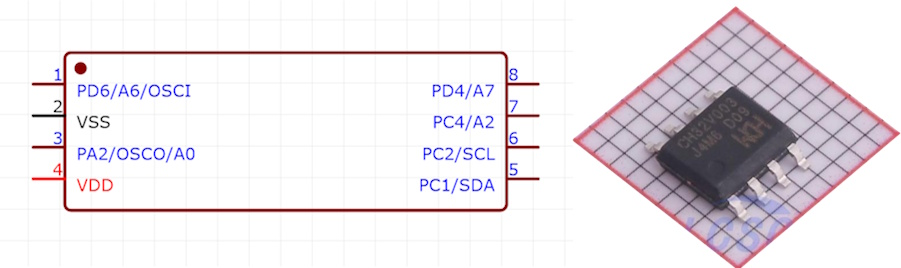
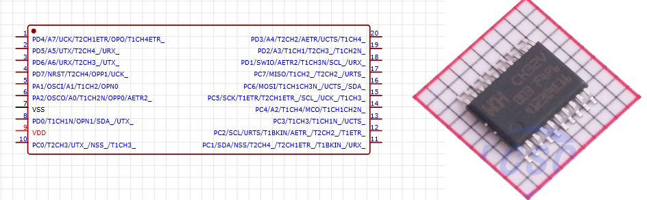
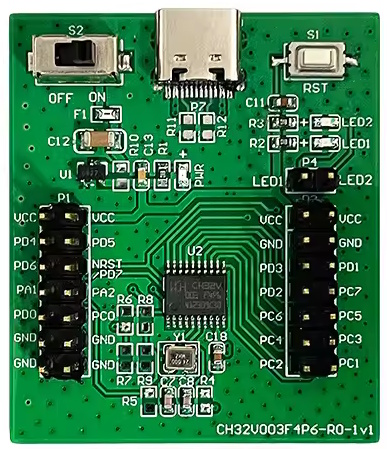

# ch32v003
Notes and code for CH32V003 RISC-V board from WCH. There is an Arduino boards definition available at https://github.com/openwch/board_manager_files/raw/main/package_ch32v_index.json but I had problems getting it to work, so instead I'm using the lightweight CH32Fun IDE instead.

## Hardware

There are various versions of the CH32V003 available, with different numbers of (available) pins. The two most common variants are:

#### CH32V003J4M6
 - 8 pin, SOP
This is the simplest, cheapest variant. Note that many of the GPIO pins are bridged between several different functions.


#### CH32V003F4P6
 - 20 pin, TSSOP
This is more feature-rich, but also an absolute bugger to solder.


To facilitate easier use of the CH32V003F4P6, it is possible to buy devboards based on it:

 
 - 1x CH32v003 devboard
 - 1x WCH-LinkE programmer
Both available at https://s.click.aliexpress.com/e/_oEjnd7A

Connect 3.3V, GND, SWDIO to VCC, GND, and P01

## Software

### Using CH32Fun (recommended)

 - Download CH32Fun from https://github.com/cnlohr/ch32fun
 - Load Powershell window
 - To execute third party scripts, first need to set execution policy:
```
Set-ExecutionPolicy -Scope Process -ExecutionPolicy Bypass
```
- Then run the CH32Fun install script from the /misc subfolder
```
cd misc
.\install_xpack_gcc.ps1
```
(press y to confirm to add xpack to the user PATH environment variable) 

- To test, build any example by changing to the examples directory
```
cd ..\examples\blink (e.g.)
make
```

The makefile will compile the code and _should_ include a step to copy it to the board, but didn't seem to work, so I also installed WCH-LinkUtility from https://www.wch.cn/downloads/WCH-LinkUtility_ZIP.html

Select the .bin file generated in the last step, and upload it to the chip. That's it!

### Using Arduino IDE
Fresh installation with support for CH32VM00X (V002/V006/etc)

 - Install latest WCH Link Utility, update LinkE device when prompted. Test connection to Link Utility and CH32 chip using Query Chip Info. (This step installs drivers and support for CH32V006 and other newer chips).
 - Run Arduino IDE as administrator, Add board json to preferences. Install WCH CH32 core v1.0.4. Exit IDE.
 - Download zip of latest master branch. Unzip and copy/overwrite all contents to this location:
        C:\Users\<username>\AppData\Local\Arduino15\packages\WCH\hardware\ch32v\1.0.4
 - Optional: review unmerged PRs for possibly required fixes and manually copy changed files.
 - Optional: for uploading to new chip: update OpenOCD obtained from MounRiver Studio.
 - Restart IDE. If new boards are not visible: clear IDE application cache.
 - Select CH32 board. Test uploading simple serial example. Test debugging.
